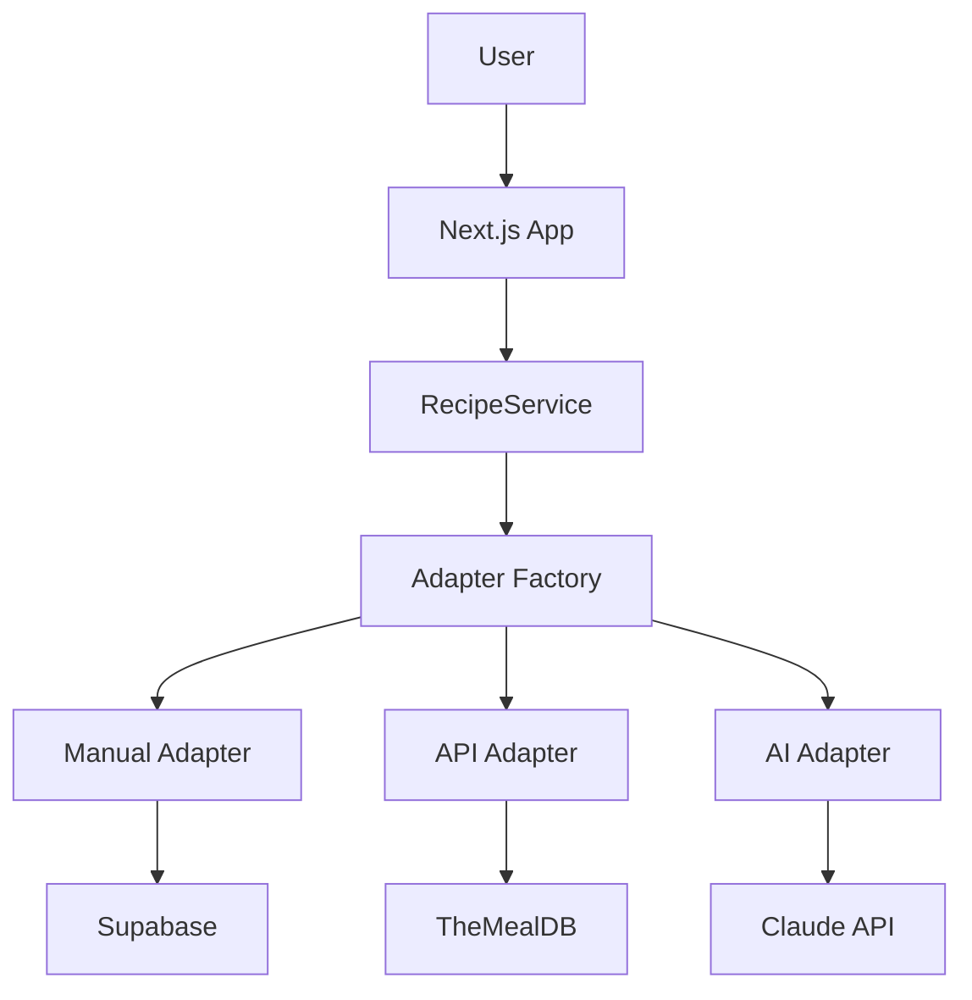

# Development Documentation

This directory contains comprehensive development documentation for the Recipe Book project.

## Documentation Structure

### `/active/recipe-book-docs/`

The main documentation set for the Recipe Book application:

1. **`recipe-book-plan.md`** (Main Strategic Plan)
   - Executive summary and vision
   - Current state analysis
   - Proposed future state (Phases 2-4)
   - Detailed implementation phases with tasks
   - Risk assessment and mitigation
   - Success metrics and timelines
   - **Read this first** for high-level understanding

2. **`recipe-book-context.md`** (Technical Reference)
   - Architectural decisions and rationale
   - Technology stack details
   - Project structure explanation
   - Database schema reference
   - Key files and their purposes
   - Development workflows
   - Troubleshooting guide
   - **Use this** when coding or debugging

3. **`recipe-book-tasks.md`** (Progress Tracker)
   - Checkbox-based task lists
   - Phase 1: Complete ✅
   - Phase 2: Next 🎯
   - Phase 3-4: Planned 📋
   - Future enhancements: Backlog 🚀
   - **Check this** to track what's done and what's next

## Quick Start

### For New Developers

1. Read `recipe-book-plan.md` - Get the big picture
2. Read `recipe-book-context.md` - Understand the architecture
3. Check `recipe-book-tasks.md` - See what's done and what's next
4. Read `/README.md` - Project overview
5. Read `/SETUP.md` - Set up your environment

### For Ongoing Development

1. Check `recipe-book-tasks.md` - Find next task
2. Reference `recipe-book-context.md` - Find relevant files
3. Code and test
4. Update task checklist
5. Update context doc if architecture changes

## Documentation Guidelines

### When to Update

**Update documentation when**:
- Major architectural decisions are made
- New features are added
- Database schema changes
- External dependencies change
- Development workflow changes

**Don't need to update for**:
- Minor bug fixes
- UI tweaks
- Code refactoring (unless pattern changes)

### How to Update

1. Edit the relevant `.md` file
2. Update "Last Updated: YYYY-MM-DD" at the top
3. Commit with descriptive message
4. Keep documentation in sync with code

### Documentation Principles

- **Self-contained**: Each doc should be readable standalone
- **Actionable**: Include specific steps, not just theory
- **Current**: Update when things change, don't let it rot
- **Honest**: Document limitations and trade-offs
- **Clear**: Write for yourself in 6 months

## File Naming Convention

```
[project-name]-[type].md

Examples:
- recipe-book-plan.md      (Strategic plan)
- recipe-book-context.md   (Technical details)
- recipe-book-tasks.md     (Task checklist)
```

## Future Documentation

As the project grows, consider adding:

- **API Documentation**: If building public APIs
- **Testing Guide**: When adding automated tests
- **Deployment Guide**: If deployment gets complex
- **Contributing Guide**: If open-sourcing
- **Architecture Diagrams**: For complex systems

## Tools for Documentation

### Viewing Markdown

- **VS Code**: Built-in Markdown preview
- **GitHub**: Renders automatically
- **Obsidian**: Great for linked docs
- **CLI**: `pandoc` to convert to PDF/HTML

### Diagramming

- **Mermaid**: Inline diagrams in Markdown
- **Excalidraw**: Hand-drawn style diagrams
- **Draw.io**: Flowcharts and diagrams

### Example Mermaid Diagram



## Maintenance

### Monthly Review

- [ ] Check for outdated information
- [ ] Update dependencies in context doc
- [ ] Review and prioritize backlog tasks
- [ ] Archive completed task lists

### Quarterly Review

- [ ] Major documentation update
- [ ] Review architectural decisions
- [ ] Update risk assessment
- [ ] Revise timeline estimates

---

**Remember**: Good documentation is code's best friend. Keep it updated, keep it useful!
